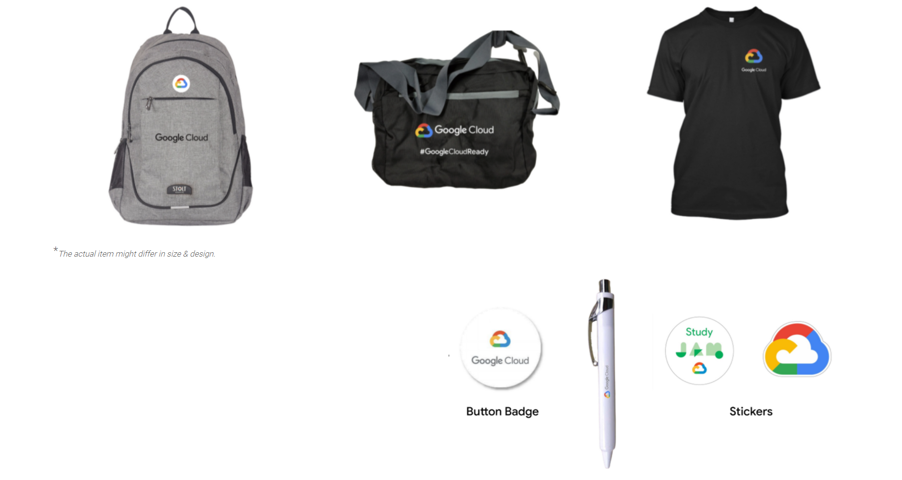

# Rules for availing the prizes
To earn prizes in the program, you need to acheive some certain milestones - "The higher the milstones, the higher the prize!"

See the milestones and the prizes associated with them below. We will record your progress on a daily basis and will evaluate it at the end of the program i.e. **20th June 2022** 11:59 PM.

---

## Milestone #1 - Complete any 10 quests & 5 skill badges in the program 

    You can earn the prizes* given below by just completing any 10 quests & 5 skill badges that are part of the program.

**Note**: Only the quest/skill badge completions after your enrolment date will be counted. Any quests/skill badges completed before the enrolment date won't be taken into account for this.

---

## Milestone #2 - Complete any 20 quests & 10 skill badges in the program
    You can earn the prizes* given below by just completing any 20 quests & 10 skill badges that are part of the program.

**Note:**
1. Only the quest/skill badge completions after your enrolment date will be counted. Any quests/skill badges completed before the enrolment date won't be taken into account for this.
2. You will receive the prizes only for the milestone achieved and not for the ones before that.

---

## Milestone #3 - Complete any 30 quests & 15 skill badges in the program
    
    You can earn the prizes* given below by just completing any 30 quests & 15 skill badges that are part of the program.

**Note:**
1. Only the quest/skill badge completions after your enrolment date will be counted. Any quests/skill badges completed before the enrolment date won't be taken into account for this.
2. You will receive the prizes only for the milestone achieved and not for the ones before that.

---

## Ultimate Milestone: Complete all 40 Quests & 20 Skill Badges
    
    You can earn the prizes* given below by completing all 40 quests & 20 skill badges that are part of the program.

**Note:**
1. Only the quest/skill badge completions after your enrolment date will be counted. Any quests/skill badges completed before the enrolment date won't be taken into account for this.
2. You will receive the prizes only for the milestone achieved and not for the ones before that.

**FREE access to the Google Cloud Career Readiness program**
Get a chance to grow your career using resources designed to build skills for a cloud-first workplace. The program will provide a chance to achieve industry-recognized credentials.

You can choose from 2 tracks in the program:
1. Associate Cloud Engineer track
2. Data Analyst track.

---

> Created and Managed by [Shivam Vishwakarma](https://www.github.com/svshiva) 