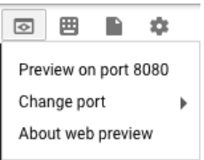
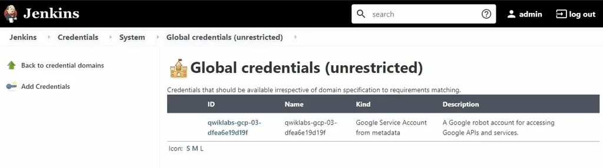
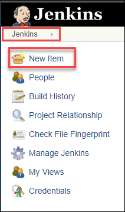
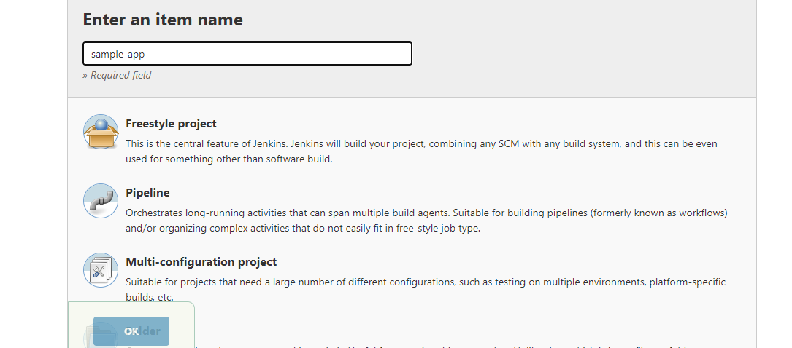
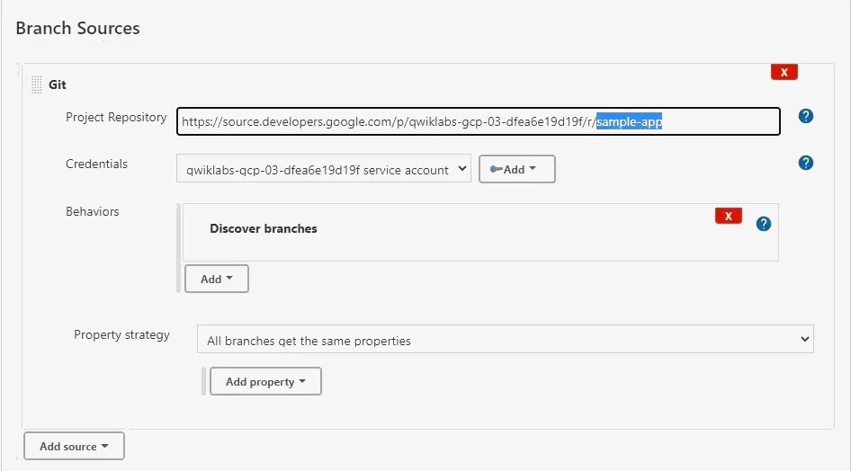
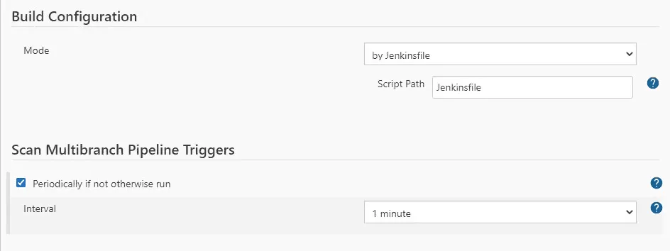
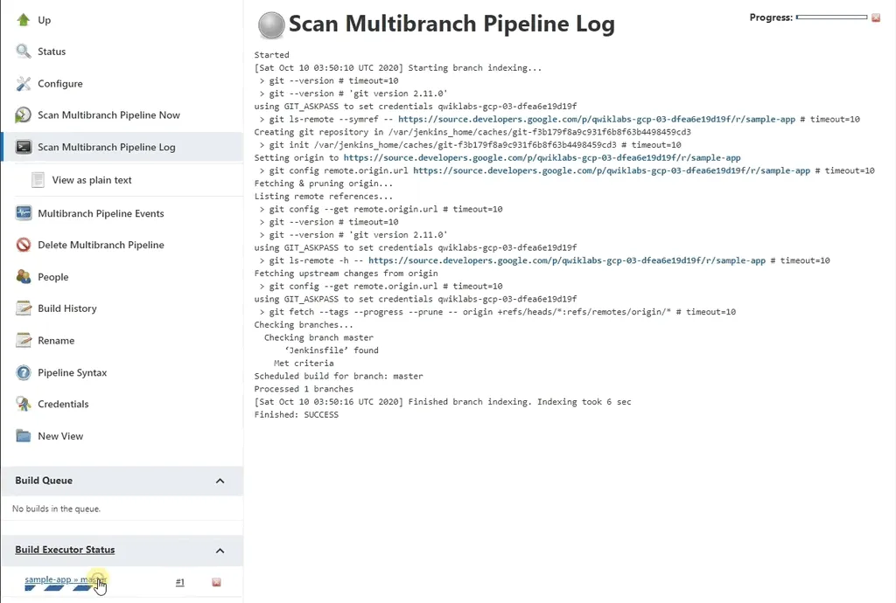

# Implement DevOps in Google Cloud: Challenge Lab

>Before starting the challenge labs,
Go to Kubernets Cluster and check if jenkins-cd is present or not. 

#### **Task 1: Configure a Jenkins pipeline for continuous deployment to Kubernetes Engine**

_Open Cloud console and run following commands_

    gcloud config set compute/zone us-east1-b

    gcloud container clusters get-credentials jenkins-cd

    kubectl create clusterrolebinding cluster-admin-binding --clusterrole=cluster-admin --user=$(gcloud config get-value account)

This will get credentials for your jenkins

Now you start the jenkins at port 8080,

    export POD_NAME=$(kubectl get pods --namespace default -l "app.kubernetes.io/component=jenkins-master" -l "app.kubernetes.io/instance=cd" -o jsonpath="{.items[0].metadata.name}")
    
    kubectl port-forward $POD_NAME 8080:8080 >> /dev/null &

The below command will give you password for your jenkins

    printf $(kubectl get secret cd-jenkins -o jsonpath="{.data.jenkins-admin-password}" | base64 --decode);echo

Now in console click on web preview button, and then click show on port 8080

-   Now enter username : **admin**
-   and enter Password that you got from **previous command**
---

### Adding your service account credentials

1. In the Jenkins user interface, click Manage Jenkins in the left navigation then click Manage Credentials.

2. Click Jenkins

3. Click **Global credentials (unrestricted).**

4. Click **Add Credentials** in the left navigation.

5. Select Google Service Account from metadata from the Kind drop-down and click OK.

Now run following command to create the Kubernetes namespace to logically isolate the deployment:

    
    kubectl create ns production

---

### Cloning the sample-app
-   goto VM Intances 
-   SSH on kraken-jumphost
-   Run the following commands in SSH window
        
        gcloud config set compute/zone us-east1-b

-   Now clone the sample app repo (Change Your-Project-ID)

        gcloud source repos clone sample-app --project=<YOUR-PROJECT-ID>

-   Now run following commands

        cd sample-app
        kubectl create ns production

### Configure the Jenkins job

1.  Click Jenkins to return the welcome page.

2.  Click New Item in the left navigation.

3.  Name the project sample-app, then choose the Multibranch Pipeline option and click OK.

4.  On the next page, in the Branch Sources section, click Add Source and select git.
5.  Paste the HTTPS clone URL of your sample-app repo in Cloud Source Repositories into the Project Repository field. Replace [PROJECT_ID] with your Project ID.

        https://source.developers.google.com/p/<YOUR-PROJECT-ID>/r/sample-app

6. Select the service account for your GCP project from the Credentials dropdown list.

> after doing so, it should look like this

7.  Check **Periodically if not otherwise run** in the Scan Multibranch Pipeline Trigger section, and then select **1 minute** for the interval.

8. Scroll to the bottom and click on Save.

---
_If you correctly configured the pipeline, you will see Finished: SUCCESS at the end of the Scan Multibranch Pipeline Log._

---

### Examine the pipeline

-   Click on sample-app » master and wait until it gives you a green tick.
-   When it gets completed go back to your lab and check if task 1 is completed.

---
## Task 2: Push an update to the application to a development branch
